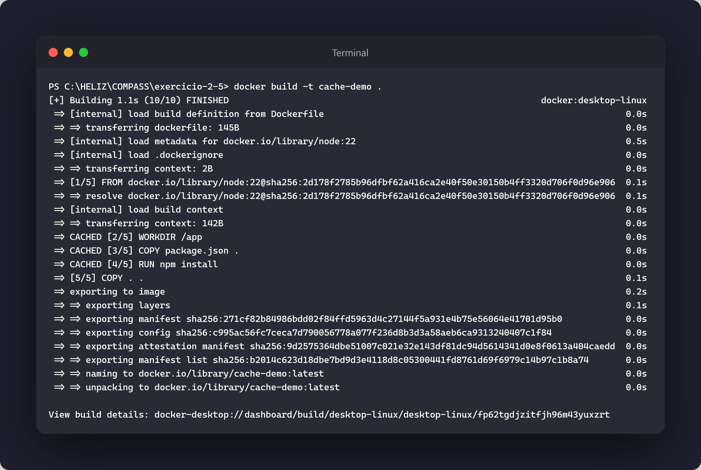
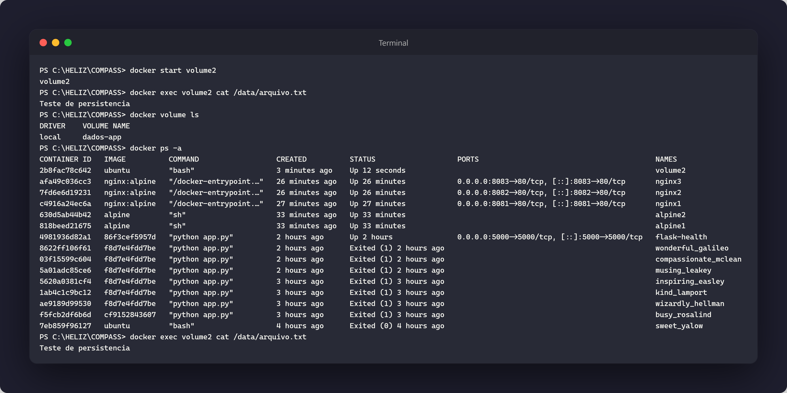
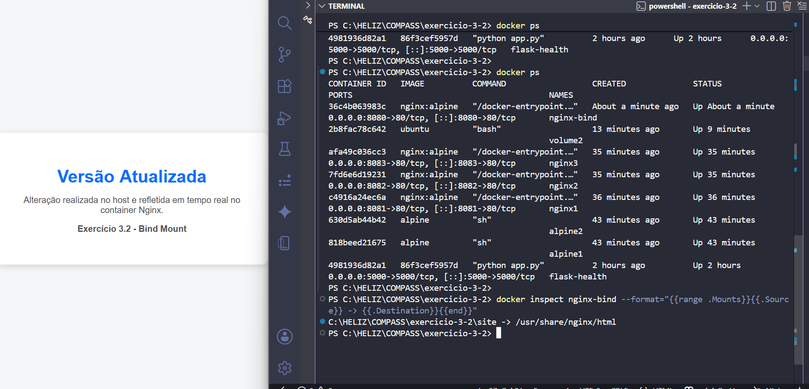

#  Exercício 1.3
Subi um container Ubuntu em modo interativo com -it
Dentro dele instalei o curl (que não existe na imagem base) e fiz uma requisição para httpbin.org, que retornou um JSON com informações da requisição
Ao sair com exit, o container parou mas continuou existindo — visível no docker ps -a com status Exited (0)
O (0) significa que saiu sem erro

# Exercício 2.1 – Primeiro Dockerfile

## Comandos

```bash
docker build --no-cache -t minha-app-python .
docker run --rm minha-app-python
```

## Arquivos criados

app.py

```python
print("Docker funcionando!")
```

Dockerfile

```dockerfile
FROM python:3.11-slim

COPY app.py .

CMD ["python", "app.py"]
```

## Resultado

A imagem foi construída com sucesso e o container executou o script Python exibindo a mensagem:

Docker funcionando!

## Observação

Durante os testes iniciais ocorreram erros de sintaxe na criação do arquivo e um problema de codificação do app.py. O arquivo foi recriado corretamente e a imagem reconstruída com `docker build --no-cache`, resolvendo o problema.


# Exercício 2.1 - Primeiro Dockerfile

Foi criada uma imagem Docker para executar uma aplicação Python simples.

**Resultado:** aplicação executada com sucesso.


---

# Exercício 2.2 - Aplicação Flask

Foi criada uma aplicação Flask containerizada com endpoint `/health`.

**Resultado:** endpoint respondendo corretamente com status HTTP 200.


---

# Exercício 2.3 - Dockerignore

Foi configurado um arquivo `.dockerignore` para evitar o envio de arquivos desnecessários para o contexto de build.

**Resultado:** build realizado com sucesso utilizando as regras definidas.


# Exercício 2.4

Foi criado um Dockerfile utilizando Multi-stage Build.

Foram geradas duas imagens:

- node-sem-multistage
- node-com-multistage

Resultado: a imagem criada com Multi-stage Build apresentou tamanho menor por conter apenas o artefato final necessário para execução.


# Exercício 2.5 - Cache de Camadas

Foi criado um Dockerfile utilizando a seguinte ordem:

1. COPY package.json .
2. RUN npm install
3. COPY . .

Essa ordem permite que o Docker reutilize a camada de instalação das dependências quando apenas o código-fonte é alterado.

Resultado: ao reconstruir a imagem, a etapa `npm install` foi recuperada do cache, reduzindo o tempo de build.



# Exercício 3.1 — Volume nomeado

Foi criado o volume nomeado `dados-app` e montado em `/data`.

Um arquivo foi criado dentro do volume utilizando um primeiro container Ubuntu.

Após remover o container, um novo container foi iniciado utilizando o mesmo volume.

Resultado: o arquivo permaneceu disponível, comprovando a persistência dos dados.



# Exercício 3.2 — Bind Mount

Foi montado um diretório local do host dentro de um container Nginx utilizando bind mount.

O diretório local foi mapeado para `/usr/share/nginx/html`.

Após alterar o arquivo `index.html` no host, a mudança foi refletida imediatamente no navegador sem necessidade de recriar o container.

Resultado: os arquivos do host foram compartilhados corretamente com o container.



# Exercício 3.3
PostgreSQL com volume persistente.

(imagens/exercicio-3-3.png)


# Exercício 4.1

Foi criada uma rede bridge personalizada chamada `minha-rede`.

Dois containers Alpine foram conectados à mesma rede.

Resultado: os containers conseguiram se comunicar utilizando o nome do container como hostname.

## Exercício 4.2 — Aplicação Python + Redis

Foi criada a rede `rede-redis`.

Um container Redis foi executado nessa rede e uma aplicação Python foi configurada para se conectar utilizando o nome do container (`redis`) como host.

A comunicação foi validada através da gravação e leitura de dados no Redis.

---

## Exercício 4.3 — Expondo portas

Foram executados três containers Nginx:

- nginx1 → porta 8081
- nginx2 → porta 8082
- nginx3 → porta 8083

Cada container serviu uma página HTML diferente e o acesso foi validado pelo navegador.

## Exercício 5.2 — App completa com Compose

### Resultado
ambiente com três serviços:

- App
- PostgreSQL
- Redis

ocorreram erros porque alguns arquivos estavam configurados incorretamente. Após corrigir o Docker Compose executou normalmente.


## Exercício 5.3 — Volumes e networks no Compose

### Resultado

Foi criado um volume nomeado para o PostgreSQL e uma network explícita para os serviços.

Após criar uma tabela e inserir registros, os containers foram removidos e recriados com Docker Compose.

Os dados permaneceram salvos após a recriação dos containers, comprovando a persistência do volume.


## Exercício 5.4 — Scaling de serviços

### Resultado

Foi criado um serviço worker stateless utilizando Docker Compose.

O ambiente foi iniciado com três réplicas do worker usando o parâmetro de escala.

A execução foi validada verificando que os três containers estavam em funcionamento.


## Exercício 5.5 — Healthcheck

### Resultado

Foram configurados healthchecks para a aplicação e para o banco de dados.

A aplicação foi configurada para iniciar apenas após o banco estar saudável.

Os serviços foram iniciados com sucesso e os healthchecks retornaram status saudável.

