# Exercícios Docker — Compass UOL

Este documento contém a resolução dos exercícios de Docker do nível básico ao intermediário. Cada exercício apresenta comandos executados, explicação do processo e evidências visuais.

---

## Nível 1 — Fundamentos

---

### Exercício 1.1 — Hello World

#### Descrição
Execução do container oficial `hello-world` para validar a instalação do Docker e o funcionamento básico do ambiente.

#### Resultado
O Docker realizou o download da imagem automaticamente (pull), criou e executou o container, exibindo a mensagem de confirmação de funcionamento do ambiente.

#### Evidência
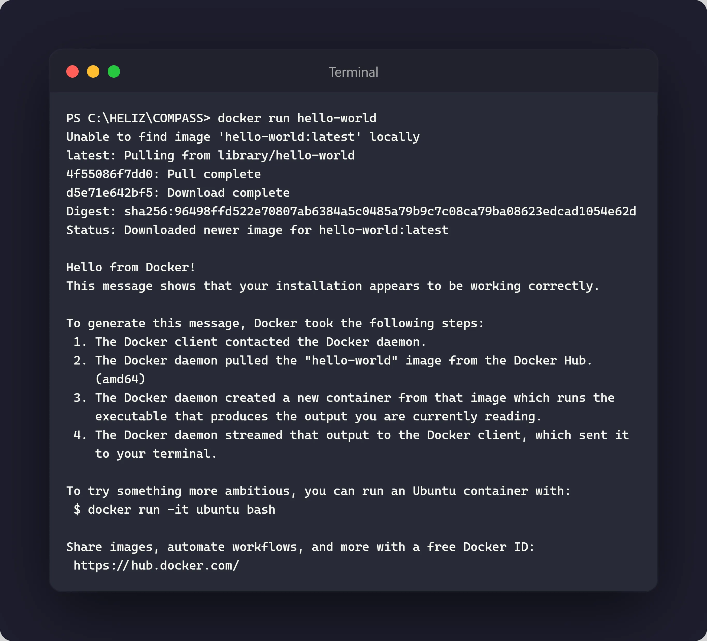

---

### Exercício 1.2 — Listar e gerenciar containers

#### Descrição
Foram utilizados comandos básicos do Docker para listar, visualizar e remover containers.

#### Resultado
Foi possível visualizar containers em execução, todos os containers existentes e remover containers parados utilizando `docker container prune`.

#### Evidência
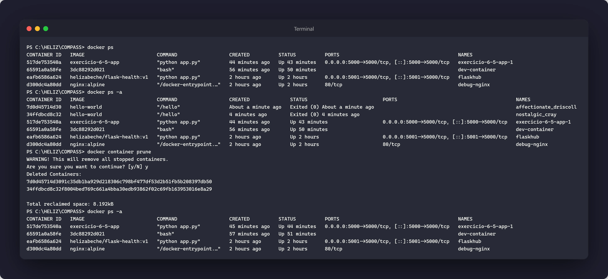

---

### Exercício 1.3 — Container Ubuntu interativo

#### Descrição
Foi executado um container Ubuntu em modo interativo. Dentro dele foi instalado o pacote `curl` e realizada uma requisição HTTP para o site httpbin.

#### Resultado
O container permitiu execução de comandos, instalação de pacotes e retorno de uma resposta JSON via HTTP. O estado `Exited (0)` confirma encerramento normal.

#### Evidência
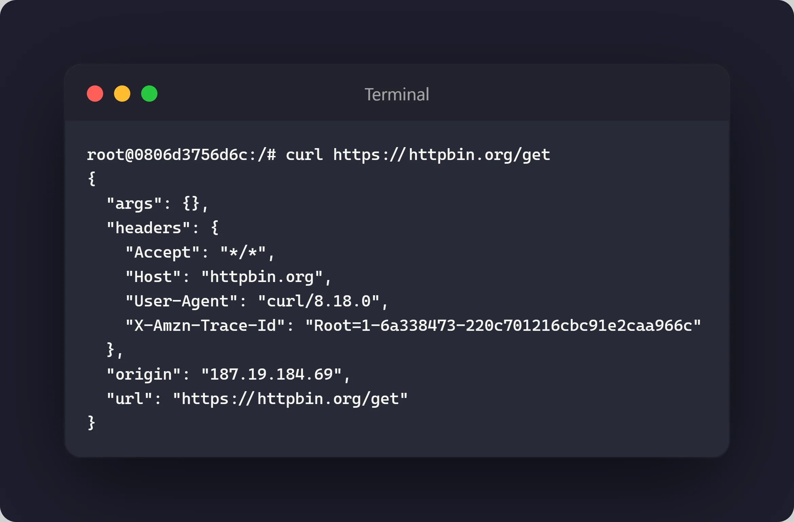

---

### Exercício 1.4 — Imagens Docker

#### Descrição
Foram listadas, baixadas e removidas imagens Docker locais.

#### Resultado
Foi possível visualizar imagens locais, baixar a imagem `nginx:alpine` e remover imagens não utilizadas com sucesso.

#### Evidência
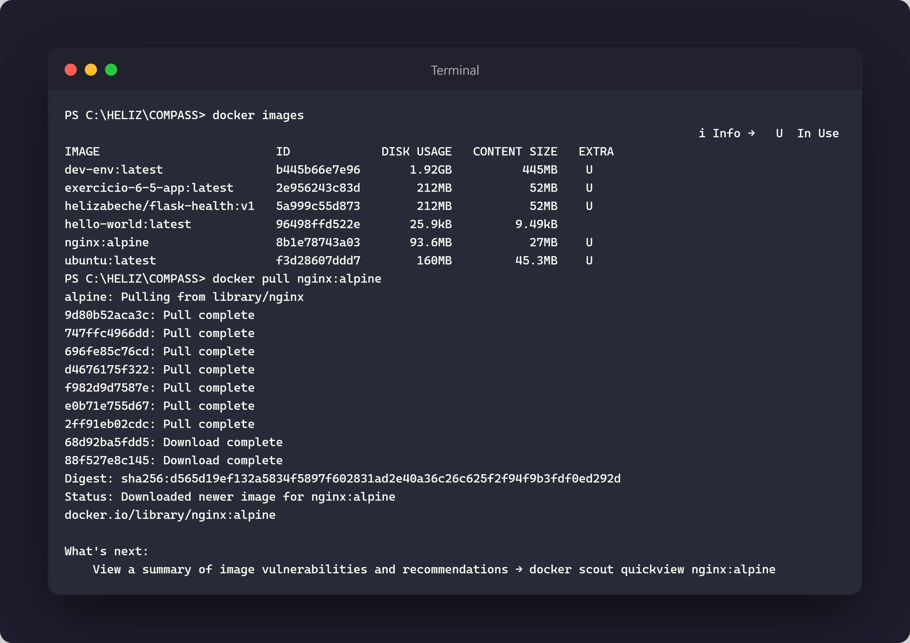

---

### Exercício 1.5 — Nginx em background

#### Descrição
Foi executado um container Nginx em modo detached com exposição de porta para acesso via navegador.

#### Resultado
O container rodou em segundo plano e disponibilizou o Nginx na porta 8080. Após validação, o container foi parado e removido.

#### Evidência
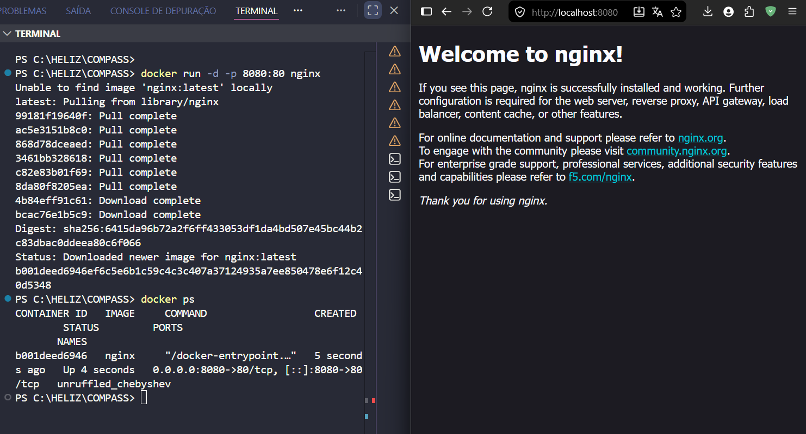

---

## Nível 2 — Dockerfile e Imagens

---

### Exercício 2.1 — Primeiro Dockerfile (Python)

#### Descrição
Foi criada uma imagem Docker baseada em Python 3.11-slim para execução de um script simples.

#### Resultado
A imagem foi construída com sucesso e o container executou o script, exibindo a mensagem “Docker funcionando!”. O container foi removido automaticamente após execução.

#### Evidência
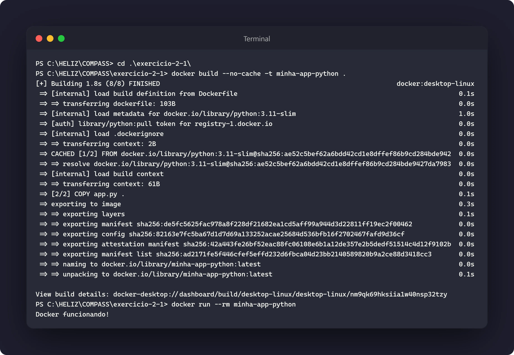

---

### Exercício 2.2 — Aplicação Flask

#### Descrição

Foi desenvolvida uma aplicação Flask com um endpoint `/health`, utilizado para verificar o status da aplicação. A aplicação foi containerizada utilizando Docker e executada com sucesso.

#### Resultado

O endpoint retornou corretamente um JSON `{"status": "ok"}` com status HTTP 200, indicando que a aplicação está funcionando normalmente dentro do container.

#### Evidência

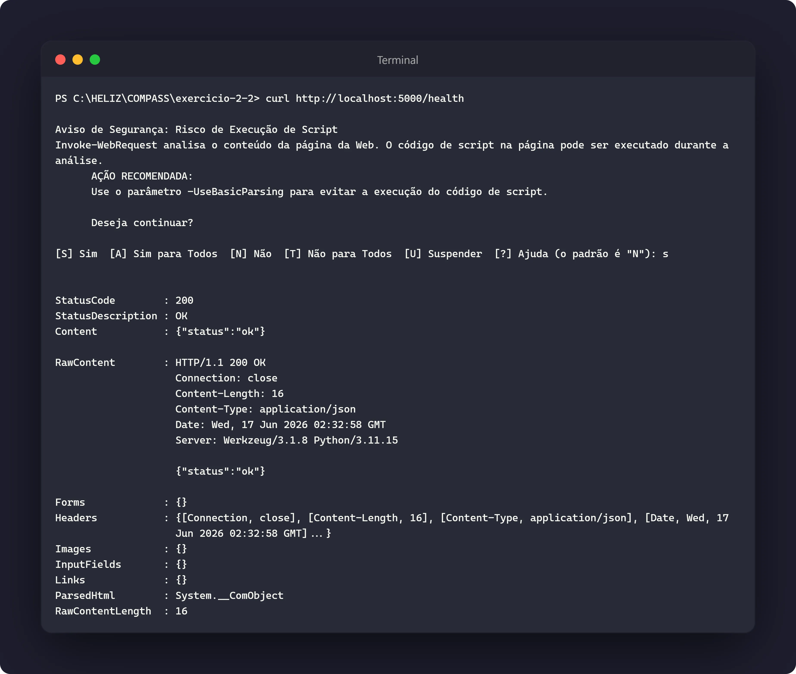

---

### Exercício 2.3 — Dockerignore

#### Descrição

Foi criado um arquivo `.dockerignore` com o objetivo de evitar que arquivos desnecessários fossem enviados para o contexto de build da imagem Docker, reduzindo tamanho e melhorando eficiência.

#### Resultado

O build da imagem ocorreu corretamente e apenas os arquivos necessários foram incluídos no contexto, demonstrando a eficácia do `.dockerignore`.

#### Evidência

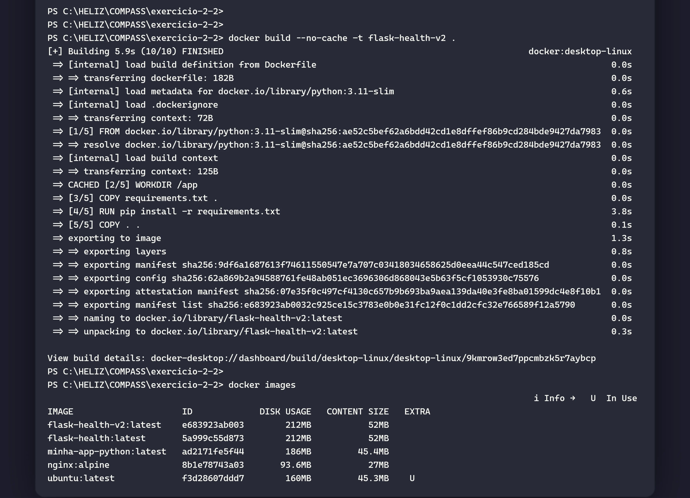

---

### Exercício 2.4 — Multi-stage build

#### Descrição

Foi implementado um Dockerfile com multi-stage build para otimizar o tamanho final da imagem. O processo separa a etapa de build da aplicação da etapa de execução.

#### Resultado

A imagem final gerada ficou significativamente menor, pois contém apenas o artefato necessário para execução da aplicação, sem dependências de build.

#### Evidência

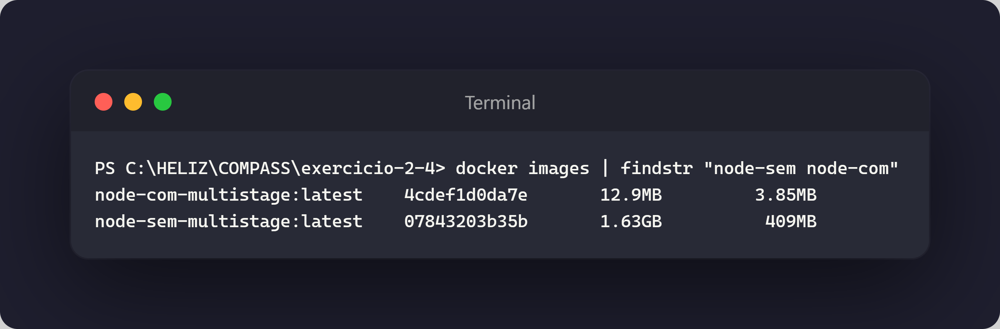

---

### Exercício 2.5 — Cache de camadas

#### Descrição

O Dockerfile foi estruturado de forma a aproveitar o cache de camadas. As dependências são instaladas antes da cópia do código-fonte, permitindo reutilização da camada `npm install` quando apenas o código é alterado.

#### Resultado

Durante novos builds, o Docker reutilizou o cache da etapa de instalação de dependências, reduzindo o tempo de build e demonstrando otimização do processo.

#### Evidência

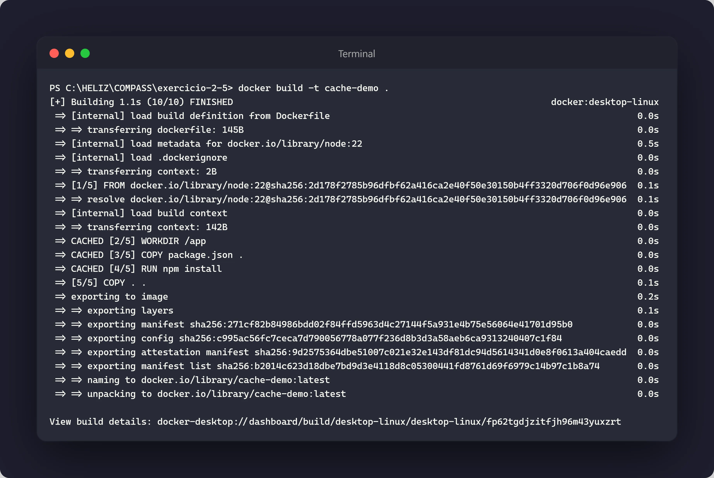

---

## Nível 3 — Volumes e Persistência

### Exercício 3.1 — Volume nomeado

#### Descrição

Foi criado um volume nomeado chamado `dados-app`, montado no diretório `/data` dentro de um container Ubuntu. Um arquivo foi criado nesse diretório para testar a persistência.

#### Resultado

Após remover o container e criar outro utilizando o mesmo volume, o arquivo permaneceu disponível, comprovando que os dados foram persistidos corretamente.

#### Evidência

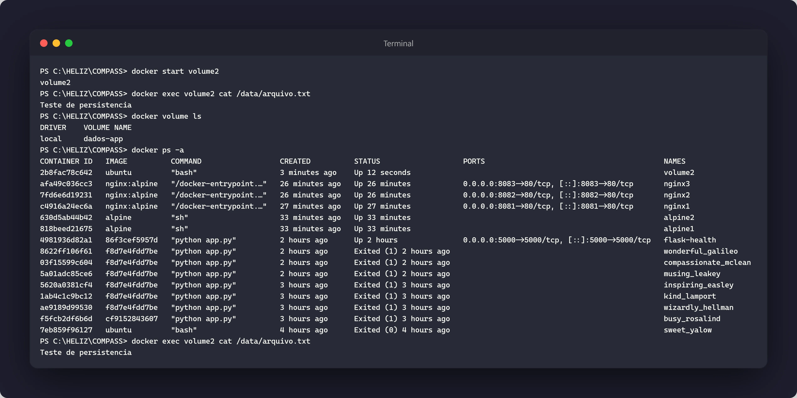

---

### Exercício 3.2 — Bind Mount

#### Descrição

Foi utilizado bind mount para conectar um diretório local ao container Nginx. O diretório do host foi mapeado para o diretório padrão de páginas web do Nginx.

#### Resultado

Qualquer alteração realizada no arquivo HTML local foi refletida imediatamente no navegador, sem necessidade de reiniciar o container.

#### Evidência

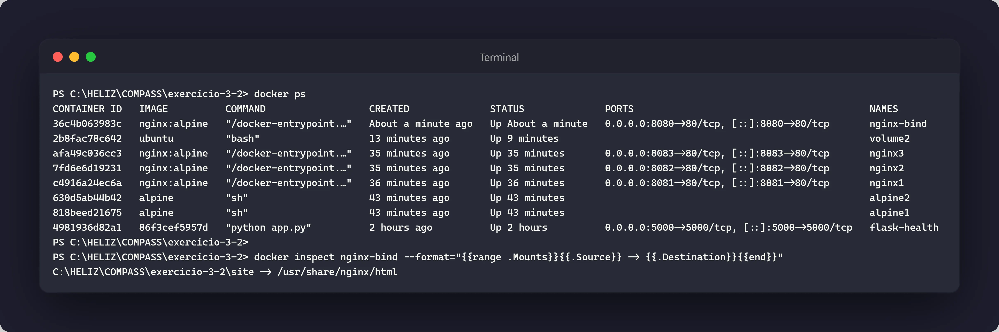
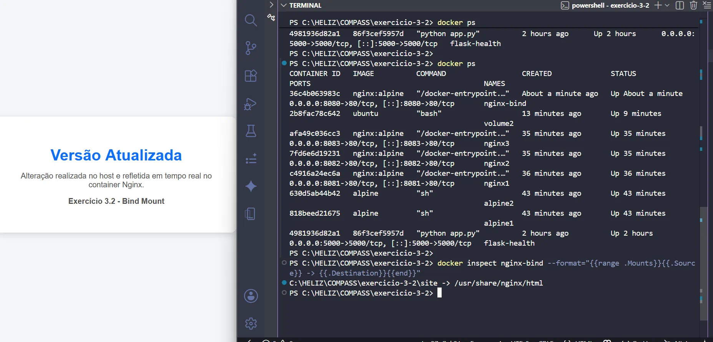

---

### Exercício 3.3 — PostgreSQL com volume

#### Descrição

Foi executado um container PostgreSQL com volume persistente para armazenamento de dados. Foram criadas tabelas e inseridos registros para validação.

#### Resultado

Mesmo após remover e recriar o container, os dados permaneceram intactos graças ao volume configurado corretamente.

#### Evidência

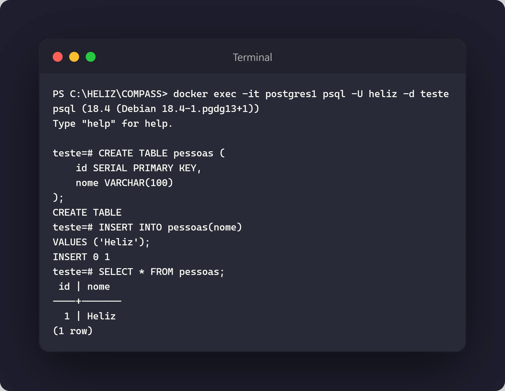

---

## Nível 4 — Networking

### Exercício 4.1 — Bridge network

#### Descrição

Foi criada uma rede Docker customizada chamada `minha-rede`. Dois containers Alpine foram conectados a essa rede para testar comunicação entre eles.

#### Resultado

Os containers conseguiram se comunicar utilizando seus nomes como hostname, demonstrando resolução interna de DNS do Docker.

#### Evidência

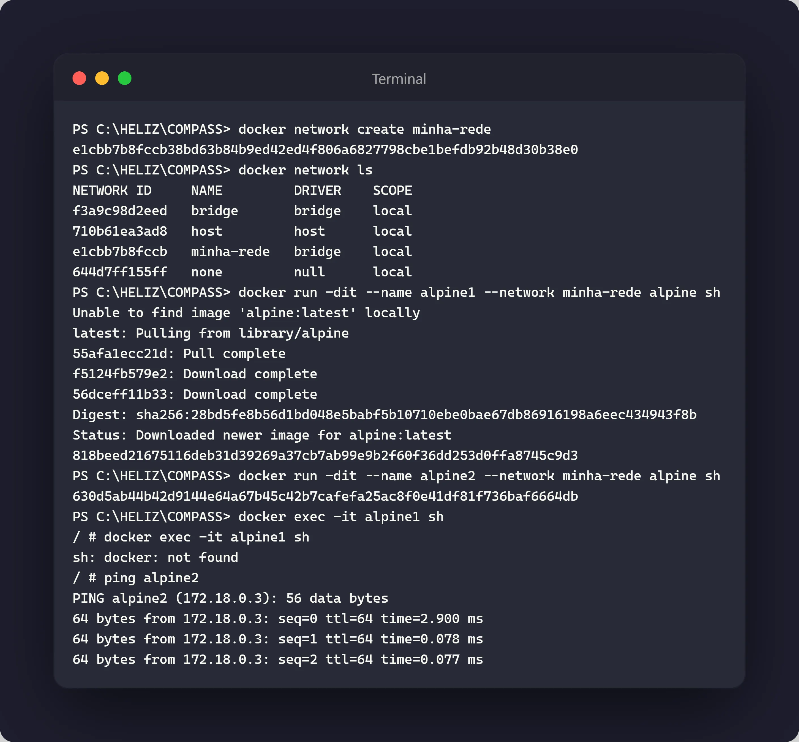

---

### Exercício 4.2 — Redis + Python

#### Descrição

Foi configurado um container Redis dentro de uma rede Docker. Uma aplicação Python foi criada para se conectar ao Redis utilizando o nome do container como host.

#### Resultado

A comunicação foi validada com sucesso através de operações de escrita e leitura (SET e GET), confirmando a integração entre os serviços.

#### Evidência

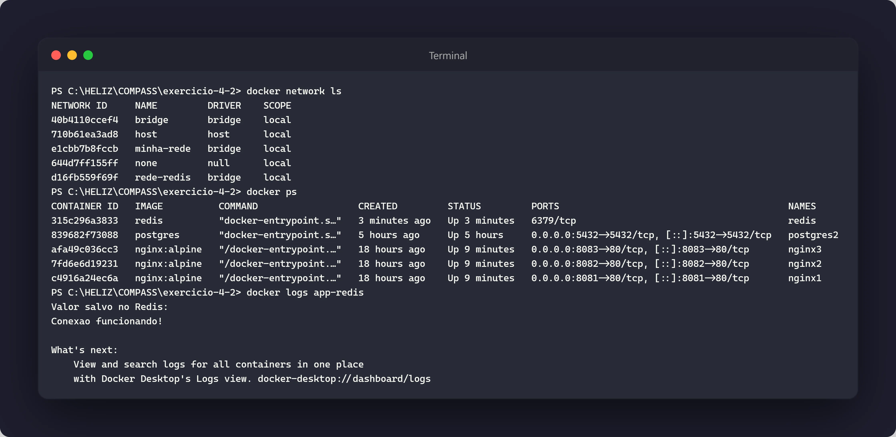

---

### Exercício 4.3 — Nginx múltiplos

#### Descrição

Foram executados três containers Nginx em portas diferentes (8081, 8082 e 8083), cada um servindo um arquivo HTML diferente.

#### Resultado

Cada serviço foi acessado individualmente via navegador, confirmando o correto mapeamento de portas.

#### Evidência

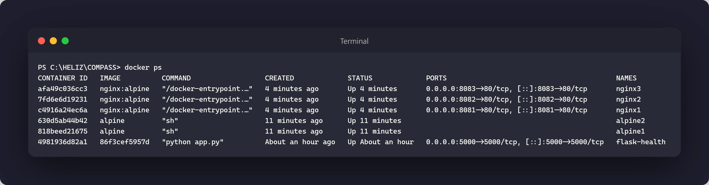
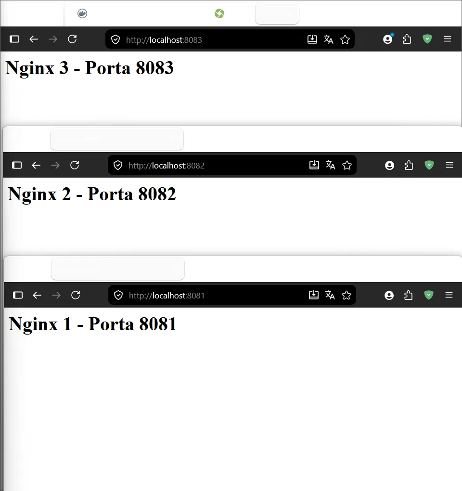

---

## Nível 5 — Docker Compose

### Exercício 5.1 — Compose básico

#### Descrição

Foram configurados serviços Nginx e PostgreSQL utilizando Docker Compose, demonstrando a facilidade de orquestração de múltiplos containers.

#### Resultado

Serviços Nginx e PostgreSQL foram configurados e executados corretamente utilizando Docker Compose.

#### Evidência

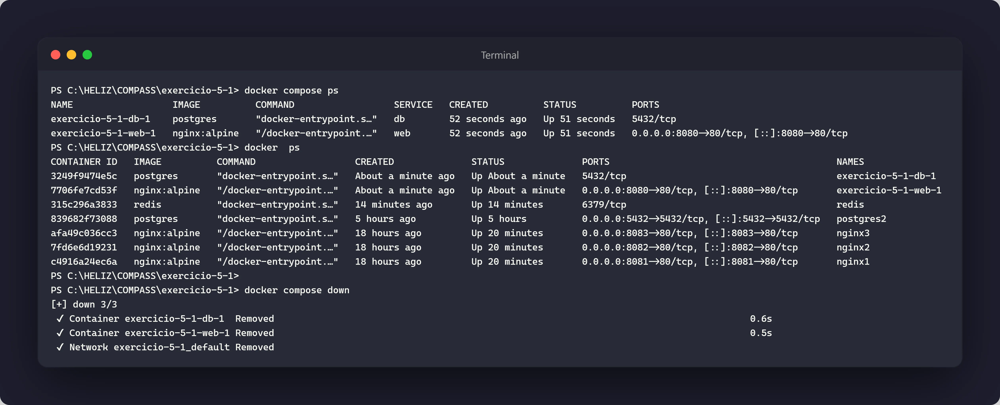

---

### Exercício 5.2 — App completa

#### Descrição

Ambiente composto por aplicação, PostgreSQL e Redis foi estruturado em um docker-compose.yml único.

#### Resultado

Ambiente composto por aplicação, PostgreSQL e Redis foi executado com sucesso após correções de configuração.

#### Evidência

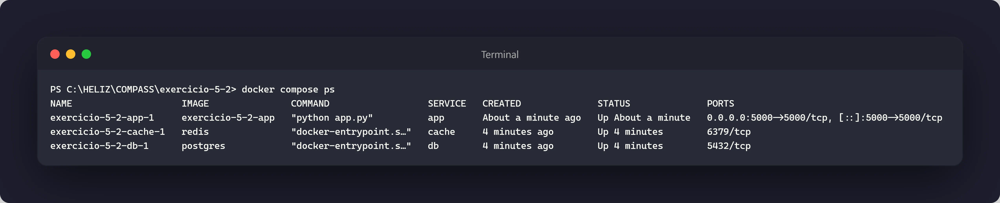

---

### Exercício 5.3 — Volumes e networks

#### Descrição

Foram configurados volumes nomeados e redes customizadas para garantir comunicação entre serviços e persistência de dados.

#### Resultado

Volumes e redes foram configurados corretamente, garantindo persistência de dados mesmo após recriação dos containers.

#### Evidência

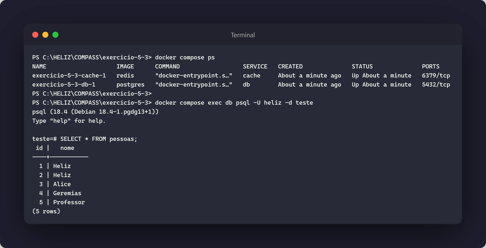

---

### Exercício 5.4 — Scaling

#### Descrição

Foi demonstrado o scaling automático de serviços através do Docker Compose, criando múltiplas instâncias de um container worker.

#### Resultado

O serviço worker foi escalado para múltiplas réplicas utilizando Docker Compose, funcionando de forma simultânea.

#### Evidência

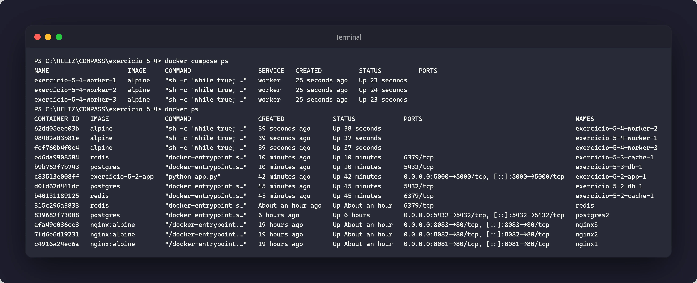

---

### Exercício 5.5 — Healthcheck

#### Descrição

Foram configurados healthchecks em serviços para monitorar seu estado de saúde e garantir inicialização adequada.

#### Resultado

Foram configurados healthchecks para garantir que os serviços só iniciem quando dependências estiverem saudáveis.

#### Evidência

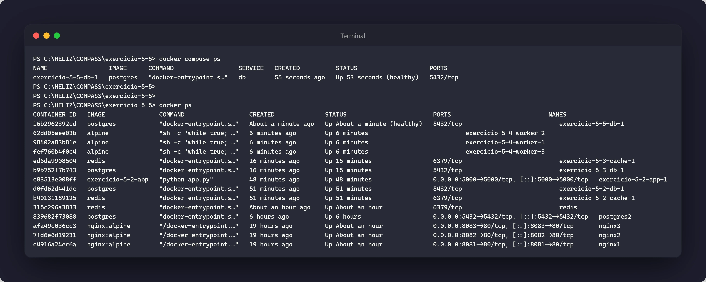

---

## Nível 6 — Práticas reais

### Exercício 6.1 — Logs e debugging

#### Descrição

Foram utilizados comandos Docker para monitorar logs, executar comandos no container e inspecionar detalhes da configuração de rede.

#### Resultado

Foi possível monitorar logs em tempo real, executar comandos dentro do container e identificar seu IP interno através do inspect.

#### Evidência

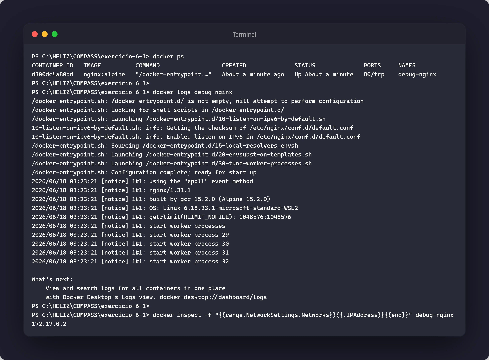

---

### Exercício 6.2 — Limite de recursos

#### Descrição

Foram aplicados limites de memória e CPU a um container para controlar o consumo de recursos do sistema.

#### Resultado

O container respeitou corretamente os limites de memória e CPU configurados, encerrando processos que ultrapassaram os limites definidos.

#### Evidência

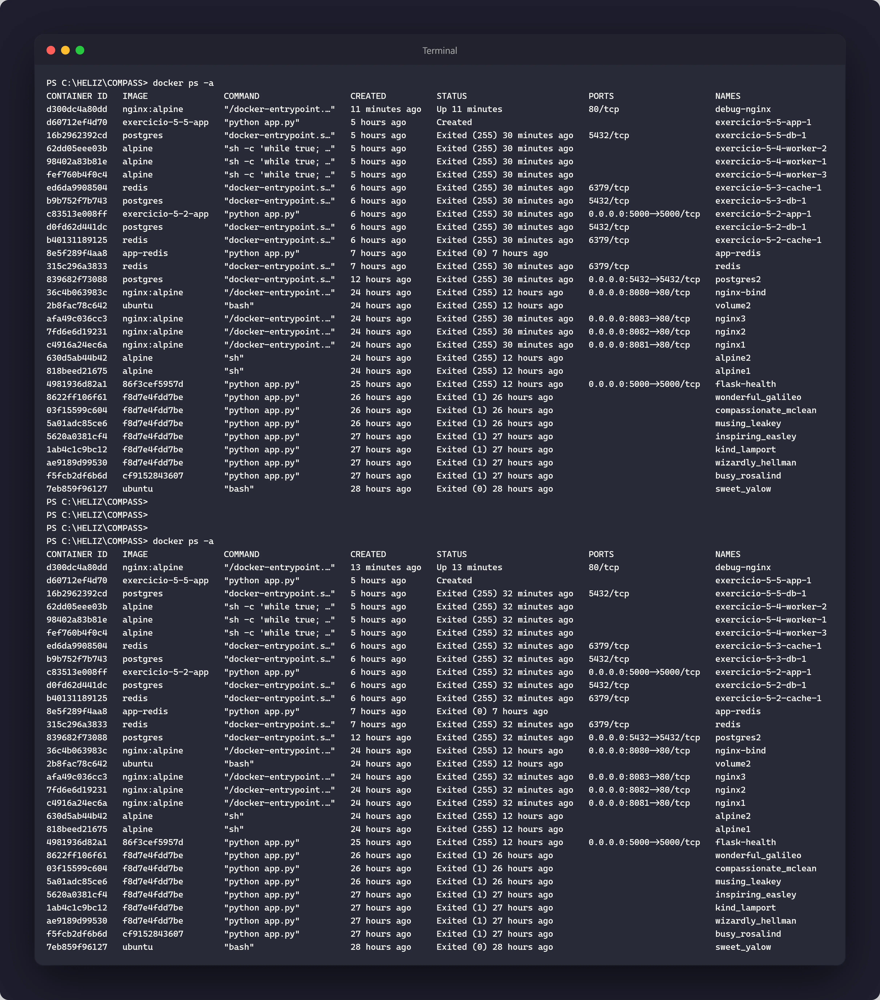

---

### Exercício 6.3 — Docker Hub

#### Descrição

Foi realizado o procedimento completo de publicação de uma imagem Docker no Docker Hub.

#### Resultado

A imagem foi enviada para o Docker Hub, removida localmente e baixada novamente com sucesso, validando o fluxo de publicação.

#### Evidência

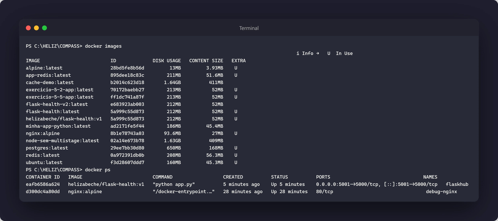

---

### Exercício 6.4 — Ambiente de desenvolvimento

#### Descrição

Foi criado um container com um ambiente completo de desenvolvimento, incluindo múltiplas linguagens de programação e ferramentas essenciais.

#### Resultado

Foi criado um ambiente de desenvolvimento completo dentro do container, com ferramentas como Node, Python e Git.

#### Evidência

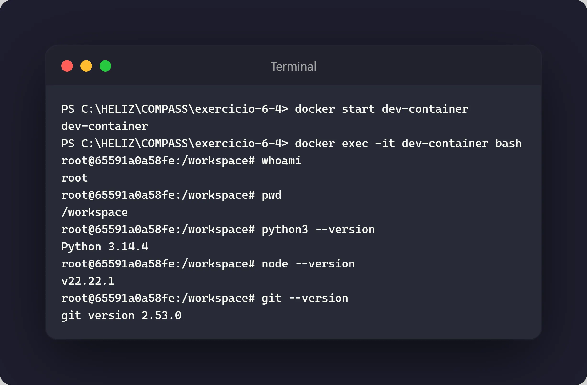

---

### Exercício 6.5 — Hot reload

#### Descrição

Foi configurado um ambiente que permite atualização automática da aplicação ao modificar arquivos locais, utilizando bind mount.

#### Resultado

A aplicação foi configurada com bind mount e atualização automática (hot reload) ao modificar arquivos locais.

#### Evidência

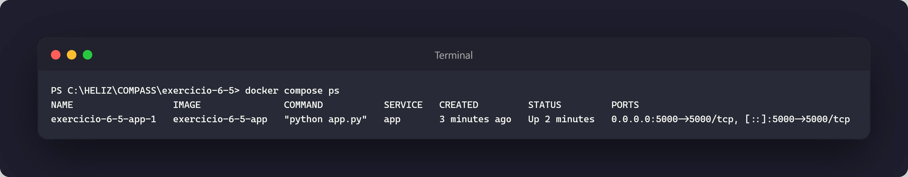

---

### Exercício 6.6 — Segurança

#### Descrição

Foi implementada a execução de container com usuário não-root, melhorando a segurança da aplicação containerizada.

#### Resultado

O container foi executado com usuário não-root, validado através do comando `whoami`.

#### Evidência

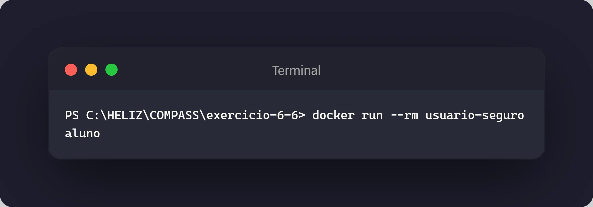

---

### Exercício 6.7 — Cleanup

#### Descrição

Foi realizada limpeza de recursos Docker não utilizados para liberar espaço em disco e manter o ambiente organizado.

#### Resultado

Foi realizada limpeza de recursos Docker não utilizados, liberando espaço em disco com sucesso.

#### Evidência

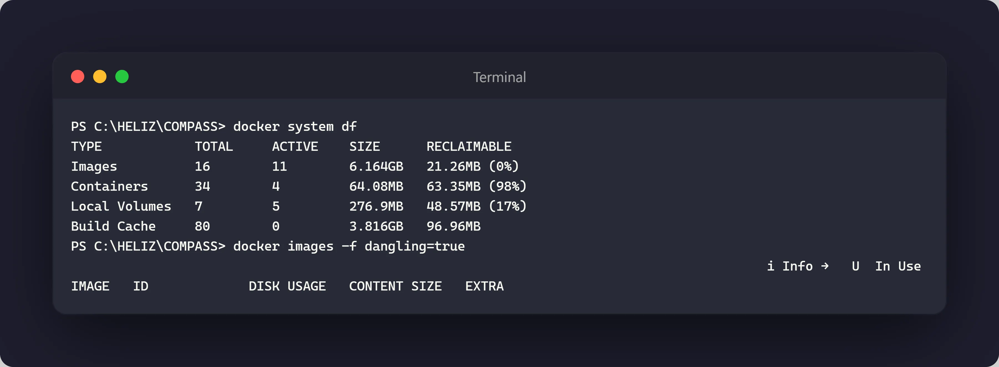

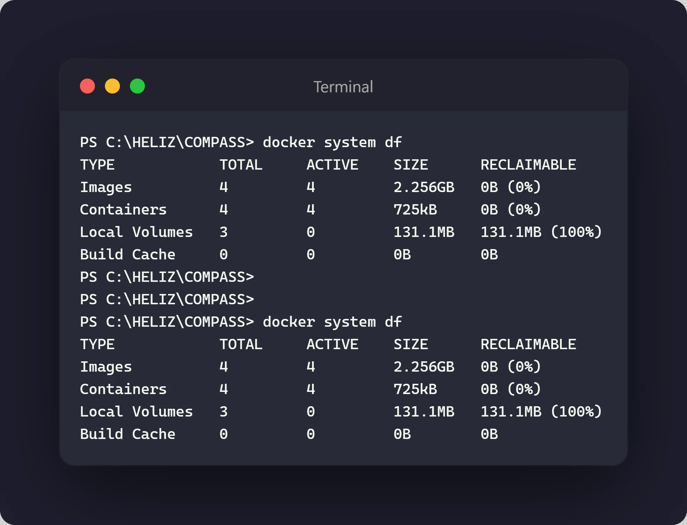
